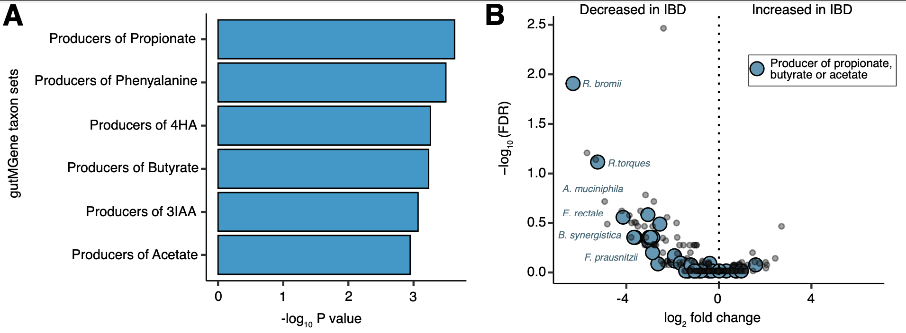

# TaxSEA: Taxon Set Enrichment Analysis
[](https://bioconductor.org/packages/TaxSEA)  
Available on [**Bioconductor**](https://bioconductor.org/packages/TaxSEA)  
[Read the paper in Briefings in Bioinformatics](https://academic.oup.com/bib/article/26/2/bbaf173/8116684)

**This repository is the companion to the Bioconductor package**: tutorials, worked
examples and issues. Install TaxSEA itself from
[Bioconductor](https://bioconductor.org/packages/TaxSEA); the guides below are at
[feargalr.github.io/TaxSEA](https://feargalr.github.io/TaxSEA/).

### What is TaxSEA? ###
TaxSEA is technique to move from analysisng individual microbes to looking at groups of microbes with a shared functional characteristic. 

Traditional microbiome analysis tools often look at individual microbes going up or down. This sounds sensible
but in human microbiome studies it can fail apart because everyone's microbiome is unique, with
few species shared across people. 

TaxSEA doesn't test for individual species but rather asks if there a group of species with a shared 
characteristic that is altered between groups of people. For example are we seeing a  shift in bugs with increased oxygen tolerance,
 or an increase in bugs which produce a certain metabolite or enzyme, or even are we seeing a change in bugs 
which have a known disease association in humans. If you want to know more check out our paper, but we find 
this approach to be far more reproducible than standard Differential Abundance (DA) analysis as well as capable of extracting biologically 
meaningful patterns. TaxSEA usually can run within seconds with standard hardware.  

TaxSEA supports **four complementary analysis modes**:

1. **Enrichment using public reference databases** – ranked taxa in, `TaxSEA()`
2. **ORA – Over-Representation Analysis** – a list of taxa in, `TaxSEA()`
3. **Enrichment using taxonomic sets** – `taxon_rank_sets()`
4. **Single sample scoring** – one score per set per sample, `ssTaxSEA()`

Modes 1 and 2 Both use the same taxon-set databases but answer slightly different questions. Mode 1 which is
the default we reccomend in most cases takes as input a list of bacteria a rank (E.g. fold change). It then tests
whether any of the taxon sets in the database are skewed to one end of the distribution or another. Mode 2 uses
the same database but only takes as input a list of bacterial names. While answering a similar question this 
approach is often less powerful as it requires a hard cut-off to select bacteria of interest. 


Mode 3 allows users to test for differences at a particular taxonomic rank. For example instead of just summing up
or aggregating all the species in a genus. We see if the distribution of species within a genus is different between groups. This
is a more powerful approach as simply summing/aggregating to a rank can risk missing when you can get shifts 
within a taxon. This approach is implemented in the `taxon_rank_sets()` function.

Mode 4 does not compare groups at all. `ssTaxSEA()` scores every taxon set within each
sample as the mean centered log-ratio of its members, giving you a sets x samples matrix
to correlate with a phenotype, model over time, or plot per sample.

In short, TaxSEA aims to make it easy to intepret changes in your microbiome data.

### Guides

| Guide | What it covers |
|---|---|
| [Why use taxon set enrichment?](https://feargalr.github.io/TaxSEA/articles/why-taxon-set-enrichment.html) | The problem with testing species one at a time |
| [Using TaxSEA](https://feargalr.github.io/TaxSEA/articles/TaxSEA.html) | The main walkthrough, from input to output |
| [Analysis types](https://feargalr.github.io/TaxSEA/articles/ORA_vs_ES.html) | Ranked enrichment vs over-representation |
| [Single sample enrichment](https://feargalr.github.io/TaxSEA/articles/single-sample-enrichment.html) | `ssTaxSEA()`, per-sample scores |
| [Taxonomic aggregation](https://feargalr.github.io/TaxSEA/articles/Taxonomic-aggregation.html) | Testing within a genus, family or phylum |
| [BacDive physiology sets](https://feargalr.github.io/TaxSEA/articles/BacDive-sets.html) | What the physiology sets are and how they are named |
| [FAQs](https://feargalr.github.io/TaxSEA/articles/FAQs.html) | Common questions |

TaxSEA takes as input a vector of species names and a rank. 
For example log2 fold changes or Spearman's rho.

Note: Although TaxSEA in principle can be applied to microbiome data from
any source, the databases utilized largely cover human associated microbiomes
and the human gut microbiome in particular. As such the database testing in TaxSEA will likely perform
best on human gut microbiome data. 

### Taxon set database
TaxSEA ships taxon sets built from five reference databases (**BacDive**, **gutMGene**,
**GMrepo v2**, **MiMeDB**, **mBodyMap**), together with sets collated from the
literature: the Gut-Brain Modules of Valles-Colomer et al., BloSSUM and VANISH sets,
and mucin degraders, siderophore producers and similar groupings.

**BugSigDB is optional and off by default.** Pass `bugsigdb = TRUE` to include it; it is
downloaded at run time. Including it also changes the p-values of every other set,
because TaxSEA compares each set against all the other taxa covered by the sets being
analysed, so leaving it off keeps results reproducible and lets TaxSEA run offline.

See below for examples of using custom databases or taxonomically defined taxon sets.

The **BacDive** sets describe measured bacterial physiology: oxygen tolerance,
Gram stain, substrate use and fermentation, enzyme activities, growth temperature,
salt and pH ranges and more, across more than 9,000 taxa. They were rebuilt in
TaxSEA 1.5.5 with new set names (e.g. `BacDive_Oxygen_facultative_anaerobe`); see the
[BacDive physiology sets](https://feargalr.github.io/TaxSEA/articles/BacDive-sets.html)
guide.

Please cite the appropriate database if using:

- Schober et al. BacDive in 2025: the core database for prokaryotic strain data.
Nucleic Acids Res. 2025.
- Cheng et al. gutMGene: a comprehensive database for target genes of gut microbes and
microbial metabolites. Nucleic Acids Res. 2022.
- Dai et al. GMrepo v2: a curated human gut microbiome database with special focus on
disease markers and cross-dataset comparison Nucleic Acids Res. 2022.
- Wishart et. al. MiMeDB: the Human Microbial Metabolome Database Nucleic Acids Res. 2023.
- Jin et al. mBodyMap: a curated database for microbes across human body and their
associations with health and diseases. Nucleic Acids Res. 2022.
- Geistlinger et al. BugSigDB captures patterns of differential abundance across a broad
range of host-associated microbial signatures. Nature Biotech. 2023.
- Valles-Colomer et al. The neuroactive potential of the human gut microbiota in quality
of life and depression. Nature Microbiology. 2019.

### Installation
```r
if (!requireNamespace("BiocManager", quietly = TRUE))
    install.packages("BiocManager")
BiocManager::install("TaxSEA")

# The development version, with the rebuilt BacDive sets:
# BiocManager::install("TaxSEA", version = "devel")
```


### Usage
#### Quick start (mode 1, enrichment rank based)
```r
library(TaxSEA)

# Retrieve taxon sets containing Bifidobacterium longum.
blong.sets <- get_taxon_sets(taxon="Bifidobacterium_longum")

# Run TaxSEA with test data provided
data(TaxSEA_test_data)
# bugsigdb = TRUE is optional and downloads BugSigDB at run time
taxsea_results <- TaxSEA(taxon_ranks=TaxSEA_test_data, bugsigdb = TRUE)

#Every set tested, all sources together
all.df <- taxsea_results$All_databases

#Enrichments among metabolite producers from gutMgene and MiMeDB
metabolites.df <- taxsea_results$Metabolite_producers

#Enrichments among health and disease signatures from GMRepoV2 and mBodyMap
disease.df <- taxsea_results$Health_associations

#Enrichments among bacterial physiology sets from BacDive
bacdive.df <- taxsea_results$BacDive_bacterial_physiology

#Enrichments among published associations from BugSigDB
bsdb.df <- taxsea_results$BugSigDB

```


#### Quick start (mode 2, ORA)
```r
library(TaxSEA)

# A list of oral taxa
test_ORA_input <- c(
  "Streptococcus_mitis",
  "Haemophilus_parainfluenzae",
  "Fusobacterium_periodonticum",
  "Fusobacterium_nucleatum",
  "Neisseria_elongata",
  "Neisseria_flavescens",
  "Streptococcus_sanguinis",
  "Streptococcus_parasanguinis",
  "Streptococcus_salivarius",
  "Capnocytophaga_sputigena"
)


taxsea_results <- TaxSEA(input_taxa=test_ORA_input)

#Enrichments among health and disease signatures from GMRepoV2 and mBodyMap
disease.df <- taxsea_results$Health_associations

```


#### Quick start (mode 4, single sample scores)
```r
library(TaxSEA)

# counts: taxa as rows, samples as columns (counts or CPM, not proportions)
scores <- ssTaxSEA(counts)

# a matrix of taxon sets (rows) x samples (columns)
dim(scores)

# correlate a set with a phenotype, or model it however suits your design
cor.test(scores["BacDive_Oxygen_facultative_anaerobe", ], calprotectin,
         method = "spearman")
```

See the [single sample enrichment](https://feargalr.github.io/TaxSEA/articles/single-sample-enrichment.html)
guide for what the score means and how to compare scores properly.


#### Input

TaxSEA supports multiple input types, depending on the analysis mode you choose:

##### Enrichment mode (rank-based; recommended)
You provide a **named numeric vector** where:

- The **names** are taxa (species or genus)
- The **values** are ranks or signed statistics (e.g. log2 fold changes, correlation coefficients)

In enrichment mode, the input **must include all taxa that were tested** in your analysis.  
Do **not** apply a significance threshold or pre-filter taxa before running TaxSEA.  
The method relies on the **full distribution** of values to detect coordinated shifts across taxon sets.

##### ORA mode (set-based)
You provide a **character vector of taxa names** representing taxa of interest (i.e. a “hit list”).

- No ranking or numeric values are required
- TaxSEA tests whether these taxa are over-represented in predefined taxon sets
- This mode is most appropriate for presence/absence or binary data


Input taxa names should be in the format of like one of the following

- Species name. E.g. "Bifidobacterium longum", "Bifidobacterium_longum"
- Genus name. E.g. "Bifidobacterium"
- NCBI ID E.g. 216816


```r
#Input IDs with the full taxonomic lineage should be split up. E.g.
x <- "d__Bacteria.p__Actinobacteriota.c__Actinomycetes.o__Bifidobacteriales.f__Bifidobacteriaceae.g__Bifidobacterium"
x <- strsplit(x,split="\\.")[[1]][6]
x <- gsub("g__","",x)

## Running this through a vector of IDs may look something like the following
#new_ids <- sapply(as.character(old_ids),function(y) {strsplit(x = y,split="\\.")[[1]][6]})
#new_ids <- gsub("g__","",new_ids)

## Example test data
library(TaxSEA)
data("TaxSEA_test_data")
head(sample(TaxSEA_test_data),4)

```


### Run TaxSEA with test data
```r
data("TaxSEA_test_data")
taxsea_results <- TaxSEA(taxon_ranks=TaxSEA_test_data, bugsigdb = TRUE)

#Enrichments among metabolite producers from gutMgene and MiMeDB
metabolites.df <- taxsea_results$Metabolite_producers

#Enrichments among health and disease signatures from GMRepoV2 and mBodyMap
disease.df <- taxsea_results$Health_associations

#Enrichments among published associations from BugSigDB
bsdb.df <- taxsea_results$BugSigDB

```


#### Test data
The test data provided with TaxSEA consists of log2 fold changes comparing between healthy 
and IBD. The count data for this was downloaded from curatedMetagenomeData and 
fold changes generated with LinDA.

- Hall et al. A novel Ruminococcus gnavus clade enriched in inflammatory 
bowel disease patients** Genome Med. 2017 Nov 28;9(1):103.
- Pasolli et al. Accessible, curated metagenomic data through 
ExperimentHub. Nat Methods. 2017 Oct 31;14(11):1023-1024. doi: 10.1038/nmeth.4468.
- Zhou et al. LinDA: linear models for differential abundance analysis of microbiome compositional data. Genome Biol. 2022 Apr 14;23(1):95.

```r
> head(sample(TaxSEA_test_data),3)
Bacteroides_thetaiotaomicron           Blautia_sp_CAG_257          Ruminococcus bromii
                       1.908                        3.650                       -5.038 
```


#### Output
The output is a list of data frames, one per group of sources, plus `All_databases`
holding every set tested:

- `All_databases` - every taxon set tested
- `Metabolite_producers` - gutMGene and MiMeDB
- `Health_associations` - GMRepoV2 and mBodyMap
- `BacDive_bacterial_physiology` - measured physiology from BacDive
- `Gut_Brain_Modules_VallesColomer2019` - gut-brain modules
- `BugSigDB` - published signatures, empty unless `bugsigdb = TRUE`

Each data frame has 6 columns

- taxonSetName - The name of the taxon set tested
- median_rank_of_set_members - This is simply the median rank across
all detected members in the set. This allows you to see
the direction of change
- PValue - Kolmogorov-Smirnov test P value.
- Test_statistic - The KS test statistic (in ORA mode this column is an odds ratio)
- FDR - P value adjusted for multiple testing.
- TaxonSet - Returns list of taxa in the set to show what is driving the signal


#### Custom databases
Many users may want to utilise TaxSEA with a custom database. For example for testing
if there is a flag in the TaxSEA function "custom_db" which expects as input a named
list of vectors. This is the same format as the default TaxSEA database. Note: using
the custom_db flag disables the automatic ID conversion and NCBI API lookup. However we have 
functionality available via other functions

```r
# Perform enrichment analysis using TaxSEA
custom_taxsea_results <- TaxSEA(taxon_ranks = log2_fold_changes, custom_db = custom_taxon_sets)
custom_taxsea_results <- custom_taxsea_results$custom_sets
```


#### Testing for differences in taxonomically defined sets
In addition to taxon sets defined from public databases by, users can define sets based on 
taxonomy from their own data. We have implemtned this in the taxon_rank_sets() function which
takes as input an set of taxa and ranks (similar to enrichment testing above) and then either
a table of taxonomic lineage or a TreeSummarizedExperiment object. See below for examples
with both approaches. 

Current methods to test at higher taxonomic levels (e.g., phylum or family), involve
aggregating counts. However, this approach may miss opposing shifts in individual species which cancel 
each other out, obscuring meaningful biological patterns. For instance, antibiotic treatment 
may suppress certain species while allowing resistant species within the same genus to expand 
and occupy the vacant niche, creating an ecological shift that appears as no net change at 
broader taxonomic levels. Whereas the database testing works best with shotgun metagenomic 
data in order to have sufficient resolution. This approach is much more widely applicable
including to testing with amplicon data such as from 16S rRNA gene sequencing. 

```r

#### Enrichment testing with taxonomically defined ranks  
# --- Example 1: Data frame input ---
# Create a lineage data frame (e.g., parsed from curatedMetagenomicData)
# The 'species' column must match the names in taxon_ranks.

lineage_df <- data.frame(
  species = c("Cutibacterium_acnes", "Klebsiella_pneumoniae",
              "Propionibacterium_humerusii", "Moraxella_osloensis",
              "Enhydrobacter_aerosaccus", "Staphylococcus_capitis",
              "Staphylococcus_epidermidis", "Staphylococcus_aureus",
              "Escherichia_coli", "Enterobacter_cloacae",
              "Pseudomonas_aeruginosa", "Acinetobacter_baumannii",
              "Lactobacillus_rhamnosus", "Lactobacillus_acidophilus",
              "Bifidobacterium_longum", "Bifidobacterium_breve"),
  kingdom = rep("Bacteria", 16),
  phylum = c("Actinobacteria", "Proteobacteria",
             "Actinobacteria", "Proteobacteria",
             "Proteobacteria", "Firmicutes",
             "Firmicutes", "Firmicutes",
             "Proteobacteria", "Proteobacteria",
             "Proteobacteria", "Proteobacteria",
             "Firmicutes", "Firmicutes",
             "Actinobacteria", "Actinobacteria"),
  class = c("Actinobacteria", "Gammaproteobacteria",
            "Actinobacteria", "Gammaproteobacteria",
            "Alphaproteobacteria", "Bacilli",
            "Bacilli", "Bacilli",
            "Gammaproteobacteria", "Gammaproteobacteria",
            "Gammaproteobacteria", "Gammaproteobacteria",
            "Bacilli", "Bacilli",
            "Actinobacteria", "Actinobacteria"),
  order = c("Propionibacteriales", "Enterobacterales",
            "Propionibacteriales", "Pseudomonadales",
            "Rhodospirillales", "Bacillales",
            "Bacillales", "Bacillales",
            "Enterobacterales", "Enterobacterales",
            "Pseudomonadales", "Pseudomonadales",
            "Lactobacillales", "Lactobacillales",
            "Bifidobacteriales", "Bifidobacteriales"),
  family = c("Propionibacteriaceae", "Enterobacteriaceae",
             "Propionibacteriaceae", "Moraxellaceae",
             "Rhodospirillaceae", "Staphylococcaceae",
             "Staphylococcaceae", "Staphylococcaceae",
             "Enterobacteriaceae", "Enterobacteriaceae",
             "Pseudomonadaceae", "Moraxellaceae",
             "Lactobacillaceae", "Lactobacillaceae",
             "Bifidobacteriaceae", "Bifidobacteriaceae"),
  genus = c("Cutibacterium", "Klebsiella",
            "Cutibacterium", "Moraxella",
            "Enhydrobacter", "Staphylococcus",
            "Staphylococcus", "Staphylococcus",
            "Escherichia", "Enterobacter",
            "Pseudomonas", "Acinetobacter",
            "Lactobacillus", "Lactobacillus",
            "Bifidobacterium", "Bifidobacterium"),
  stringsAsFactors = FALSE
)

set.seed(42)
fc <- setNames(rnorm(16), lineage_df$species)
results <- taxon_rank_sets(fc, lineage_df, min_set_size = 2)
names(results)
results$family


# --- Example 2: SummarizedExperiment / TreeSummarizedExperiment input ---
library(mia)
library(TaxSEA)
library(ALDEx2)

data(GlobalPatterns, package = "mia")
tse <- GlobalPatterns

# Subset to two sample types for a two-group comparison
tse <- tse[, colData(tse)$SampleType %in% c("Feces", "Soil")]

# Filter low-prevalence features (present in at least 2 samples)
tse <- tse[rowSums(assay(tse, "counts") > 0) >= 2, ]

# Run ALDEx2
set.seed(1)
x <- aldex.clr(
  reads = assay(tse, "counts"),
  conds = as.character(colData(tse)$SampleType),
  mc.samples = 128,
  denom = "all",
  verbose = FALSE
)
x_tt <- aldex.ttest(x, paired.test = FALSE, verbose = FALSE)
x_effect <- aldex.effect(x, CI = TRUE, verbose = FALSE)
aldex_out <- data.frame(x_tt, x_effect)

# Use ALDEx2 effect size as ranking metric
fc <- aldex_out$effect
names(fc) <- rownames(aldex_out)

# Run taxon rank set enrichment directly from the TSE
results <- taxon_rank_sets(fc, tse, min_set_size = 5)

names(results)    # Kingdom, Phylum, Class, Order, Family, Genus
head(results$Family)
head(results$Genus)

```


#### Visualisation of TaxSEA output. 





The results above were generated by using TaxSEA on the output of 
a differential abundance analysis comparing between disease and
control. The input was per species log2 fold changes between taxa in
Inflammatory Bowel disease and control. TaxSEA identified a significant depletion
in the producers of certain short chain fatty acids. Using barplots we can show
the overall signatures identified as significantly different. We can then highlight
the individual species contributing to this signature on a volcano plot. 


#### BugSigDB
The format of BugSigDB is that each publication is entered as a "Study", and within this there is different 
experiments and signatures. For example one of the signatures  may be taxa increased in an experiment, and another signature is
taxa that are decreased. Users can find out more by querying the BugSigDB. In recent updates BugSigDB has moved to using the PubMed ID as the study ID (Although not all studies have these yet).  See below for an example. 

```r
library(bugsigdbr) #This package is installable via Bioconductor
bsdb <- importBugSigDB() #Import database 

#E.g. if the BugSigDB identifier you found enriched was bsdb:11/1/1
#This is Study 11, Experiment 1, Signature 1
bsdb[bsdb$Study=="Study 11" & 
     bsdb$Experiment=="Experiment 1" & 
     bsdb$Signature=="Signature 1",]


```


#### TaxSEA database with other enrichment tools
The TaxSEA function by default uses the Kolmogorov Smirnov test and the 
original idea was inspired by gene set enrichment analyses from RNASeq.
Should users wish to use an alternative gene set enrichment analysis tool
the database is formatted in such a way that should be possible. See below
for an example with fast gene set enrichment analysis (fgsea). 

```r
library(fgsea) #This package is installable via Bioconductor
data(TaxSEA_db)
#Convert input names to NCBI taxon ids
names(TaxSEA_test_data) = get_ncbi_taxon_ids(names(TaxSEA_test_data))
TaxSEA_test_data = TaxSEA_test_data[!is.na(names(TaxSEA_test_data))]

#Run fgsea
fgsea_results <- fgsea(TaxSEA_db, TaxSEA_test_data, minSize=5, maxSize=500)
```
