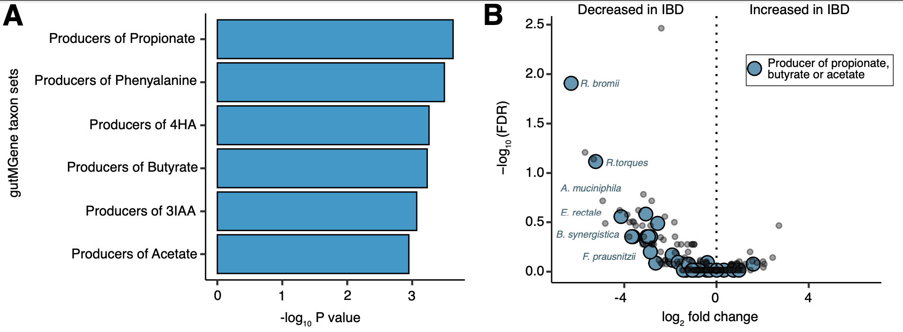

# TaxSEA: Taxon Set Enrichment Analysis

[](https://bioconductor.org/packages/TaxSEA)  
Available on
[**Bioconductor**](https://bioconductor.org/packages/TaxSEA)  
[Read the paper in Briefings in
Bioinformatics](https://academic.oup.com/bib/article/26/2/bbaf173/8116684)


### What is TaxSEA?

Traditional differential abundance (DA) analysis looks at individual
microbes going up or down. This sounds sensible but in human microbiome
studies it often falls apart because everyone’s microbiome is unique,
with few species shared across people. TaxSEA doesn’t seem to test for
individual species are different but rather is there a group of species
with a shared characteristic that is different. For example are we
seeing a shift in bugs with increased oxygen tolerance, or an increase
in bugs which produce a certain metabolite or enzyme, or even are we
seeing a change in bugs which have a known disease association in
humans. If you want to know more check out our paper, but we find this
approach to be far more reproducible than standard DA analysis as well
as capable of extracting biologically meaningful patterns.

TaxSEA can also test for differences at a particular taxonomic rank. For
example instead of just summing up all the species in a genus. We see if
the distribution of species within a genus is different between groups.

In short, TaxSEA makes it easy to intepret changes in your microbiome
data.

TaxSEA takes as input a vector of genus or species names and a rank. For
example log2 fold changes or Spearman’s rho. TaxSEA then uses a
Kolmogorov-Smirnov test to identify if a particular group of species or
genera (i.e. a set of taxa such as butyrate producers) are skewed to one
end of the distribution.

Note: Although TaxSEA in principle can be applied to microbiome data
from any source, the databases utilized largely cover human associated
microbiomes and the human gut microbiome in particular. As such TaxSEA
will likely perform best on human gut microbiome data.

### Taxon set database

By default TaxSEA utilizes taxon sets generated from six reference
databases (**BacDive**,**gutMGene**, **GMrepo v2**, **MiMeDB**,
**mBodyMap**, **BugSigDB**). See below for examples of using custom
databases or taxonomically defined taxon sets.

Please cite the appropriate database if using:

- Schober et al. BacDive in 2025: the core database for prokaryotic
  strain data. Nucleic Acids Res. 2025.
- Cheng et al. gutMGene: a comprehensive database for target genes of
  gut microbes and microbial metabolites. Nucleic Acids Res. 2022.
- Dai et al. GMrepo v2: a curated human gut microbiome database with
  special focus on disease markers and cross-dataset comparison Nucleic
  Acids Res. 2022.
- Wishart et. al. MiMeDB: the Human Microbial Metabolome Database
  Nucleic Acids Res. 2023.
- Jin et al. mBodyMap: a curated database for microbes across human body
  and their associations with health and diseases. Nucleic Acids Res.
  2022.
- Geistlinger et al. BugSigDB captures patterns of differential
  abundance across a broad range of host-associated microbial
  signatures. Nature Biotech. 2023.

### Installation

``` r
if (!requireNamespace("BiocManager", quietly = TRUE))
    install.packages("BiocManager")
BiocManager::install("TaxSEA")
```

### Usage

#### Quick start

``` r
library(TaxSEA)

# Retrieve taxon sets containing Bifidobacterium longum.
blong.sets <- get_taxon_sets(taxon="Bifidobacterium_longum")

# Run TaxSEA with test data provided
data(TaxSEA_test_data)
taxsea_results <- TaxSEA(taxon_ranks=TaxSEA_test_data)

#Enrichments among metabolite producers from gutMgene and MiMeDB
metabolites.df <- taxsea_results$Metabolite_producers

#Enrichments among health and disease signatures from GMRepoV2 and mBodyMap
disease.df <- taxsea_results$Health_associations

#Enrichments among published associations from BugSigDB
bsdb.df <- taxsea_results$BugSigdB
```

#### Input

All that is required for TaxSEA is a vector in R containing ranks (e.g.
log2 fold changes) and names (E.g. species/genus). TaxSEA will not work
for ranks higher than species or genus. The input should be for all taxa
tested, and not limited to only a pre-defined set (e.g. do not use a
threshold for significance or remove any taxa). See example below for
format. TaxSEA will lookup and convert taxon names to NCBI taxonomic
identifiers. TaxSEA stores a commonly observed identifiers internally
and so will only look up whatever is not covered to save time.

Input IDs should be in the format of like one of the following

- Species name. E.g. “Bifidobacterium longum”, “Bifidobacterium_longum”
- Genus name. E.g. “Bifidobacterium”
- NCBI ID E.g. 216816

``` r
#Input IDs with the full taxonomic lineage should be split up. E.g.
x <- "d__Bacteria.p__Actinobacteriota.c__Actinomycetes.o__Bifidobacteriales.f__Bifidobacteriaceae.g__Bifidobacterium"
x <- strsplit(x,split="\\.")[[1]][6]
x <- gsub("g__","",x)

## Running this through a vector of IDs may look something like the following
#new_ids <- sapply(as.character(old_ids),function(y) {strsplit(x = y,split="\\.")[[1]][6]})
#new_ids <- gsub("g__","",new_ids)

## Example test data
library(TaxSEA)
data("TaxSEA_test_data")
head(sample(TaxSEA_test_data),4)
```

### Run TaxSEA with test data

``` r
data("TaxSEA_test_data")
taxsea_results <- TaxSEA(taxon_ranks=TaxSEA_test_data)

#Enrichments among metabolite producers from gutMgene and MiMeDB
metabolites.df <- taxsea_results$Metabolite_producers

#Enrichments among health and disease signatures from GMRepoV2 and mBodyMap
disease.df <- taxsea_results$Health_associations

#Enrichments among published associations from BugSigDB
bsdb.df <- taxsea_results$BugSigDB
```

#### Test data

The test data provided with TaxSEA consists of log2 fold changes
comparing between healthy and IBD. The count data for this was
downloaded from curatedMetagenomeData and fold changes generated with
LinDA.

- Hall et al. A novel Ruminococcus gnavus clade enriched in inflammatory
  bowel disease patients\*\* Genome Med. 2017 Nov 28;9(1):103.
- Pasolli et al. Accessible, curated metagenomic data through
  ExperimentHub. Nat Methods. 2017 Oct 31;14(11):1023-1024. doi:
  10.1038/nmeth.4468.
- Zhou et al. LinDA: linear models for differential abundance analysis
  of microbiome compositional data. Genome Biol. 2022 Apr 14;23(1):95.

``` r
> head(sample(TaxSEA_test_data),3)
Bacteroides_thetaiotaomicron           Blautia_sp_CAG_257          Ruminococcus bromii
                       1.908                        3.650                       -5.038 
```

#### Output

The output is a list of three data frames providing enrichment results
for metabolite producers, health/disease associations, and published
signatures from BugSigDB. Each dataframe has 5 columns

- taxonSetName - The name of the taxon set tested
- median_rank - This is simply the median rank across all detected
  members in the set. This allows you to see the direction of change
- P value - Kolmogorov-Smirnov test P value.
- FDR - P value adjusted for multiple testing.
- TaxonSet - Returns list of taxa in the set to show what is driving the
  signal

#### Custom databases

Many users may want to utilise TaxSEA with a custom database. For
example for testing if there is a flag in the TaxSEA function
“custom_db” which expects as input a named list of vectors. This is the
same format as the default TaxSEA database. Note: using the custom_db
flag disables the automatic ID conversion and NCBI API lookup. However
we have functionality available via other functions

``` r
# Perform enrichment analysis using TaxSEA
custom_taxsea_results <- TaxSEA(taxon_ranks = log2_fold_changes, custom_db = custom_taxon_sets)
custom_taxsea_results <- custom_taxsea_results$custom_sets
```

#### Testing for differences in taxonomically defined sets

In addition to taxon sets defined by function or phenotype, users can
define sets based on taxonomy. Current methods to test at higher
taxonomic levels (e.g., genus or family), involve aggregating counts but
with this approach opposing shifts in individual species may cancel each
other out, obscuring meaningful biological patterns. For instance,
antibiotic treatment may suppress certain species while allowing
resistant species within the same genus to expand and occupy the vacant
niche, creating an ecological shift that appears as no net change at
broader taxonomic levels. Here we utilise data from Chng et
al. demonstrating this in a comparison between Atopic dermatitis and
controls.

``` r

#### Applying TaxSEA functionality to taxonomic ranks  
# This script applies TaxSEA to identify taxonomic enrichment at different taxonomic levels.
# Specifically, we analyze enrichment at the family level using metagenomic data

# Load required libraries
library(TaxSEA)
library(curatedMetagenomicData)
library(tidyverse)
library(phyloseq)
library(MicrobiomeStat)
library(dplyr)

# Load sample metadata
metadata_all <- sampleMetadata

# Filter metadata for the specific study (ChngKR_2016)
metadata <- metadata_all %>% 
  filter(study_name == "ChngKR_2016") %>% 
  column_to_rownames('sample_id')

# Extract count data using curatedMetagenomicData
cmd_data <- curatedMetagenomicData(
  pattern = "ChngKR_2016.relative_abundance",
  counts = TRUE,
  dryrun = FALSE
)

# Convert the extracted data to a count matrix
counts_data <- assay(cmd_data[[1]])
counts_data <- counts_data[, rownames(metadata)]  # Subset to relevant samples

# Filter taxa with at least one sample having counts > 100
counts_data <- counts_data[apply(counts_data > 100, 1, sum) > 0, ]

# Extract species names from taxonomic strings
species_names <- gsub("s__", "", sapply(rownames(counts_data), function(y) strsplit(y, "\\|")[[1]][7]))
rownames(counts_data) <- species_names

# Create a taxonomic lineage dataframe
# Remove taxonomic prefixes (k__, p__, c__, etc.) and separate into taxonomic ranks

# make data frame of taxon lineages
taxon_lineages <- data.frame(Name = species_names,
                             Lineage = names(species_names)) %>%
  mutate(Lineage = str_remove_all(Lineage, '[kpcofgs]__')) %>%
  separate(col = Lineage, into = c('kingdom', 'phylum', 'class', 
                                   'order', 'family', 'genus', 'species'), 
           sep = '\\|') %>%
  mutate(name = Name) %>%
  remove_rownames() %>%
  column_to_rownames('name')

# Perform differential abundance testing using LinDA
metadata$study_condition <- factor(metadata$study_condition, levels = c("control", "AD"))

linda_results <- linda(
  feature.dat = counts_data,
  meta.dat = metadata,
  formula = '~study_condition',
  feature.dat.type = 'count',
  prev.filter = 0.05
)

# Extract log2 fold change values for differential taxa
linda_results <- linda_results$output$study_conditionAD
log2_fold_changes <- linda_results$log2FoldChange
names(log2_fold_changes) <- rownames(linda_results)

# Define the taxonomic rank for enrichment analysis
selected_taxon_level <- 'genus'  # Modify as needed (e.g., genus, phylum)

# Create a named list of species grouped by taxonomic rank
custom_taxon_sets <- taxon_lineages %>%
  group_by(.data[[selected_taxon_level]]) %>% 
  summarise(species = list(species), .groups = "drop") %>%
  deframe()

# Perform enrichment analysis using TaxSEA
custom_taxsea_results <- TaxSEA(taxon_ranks = log2_fold_changes, custom_db = custom_taxon_sets)
custom_taxsea_results <- custom_taxsea_results$custom_sets
```

#### Visualisation of TaxSEA output.



The results above were generated by using TaxSEA on the output of a
differential abundance analysis comparing between disease and control.
The input was per species log2 fold changes between taxa in Inflammatory
Bowel disease and control. TaxSEA identified a significant depletion in
the producers of certain short chain fatty acids. Using barplots we can
show the overall signatures identified as significantly different. We
can then highlight the individual species contributing to this signature
on a volcano plot.

#### BugSigDB

The format of BugSigDB is that each publication is entered as a “Study”,
and within this there is different experiments and signatures. For
example one of the signatures may be taxa increased in an experiment,
and another signature is taxa that are decreased. Users can find out
more by querying the BugSigDB. In recent updates BugSigDB has moved to
using the PubMed ID as the study ID (Although not all studies have these
yet). See below for an example.

``` r
library(bugsigdbr) #This package is installable via Bioconductor
bsdb <- importBugSigDB() #Import database 

#E.g. if the BugSigDB identifier you found enriched was bsdb:11/1/1
#This is Study 11, Experiment 1, Signature 1
bsdb[bsdb$Study=="Study 11" & 
     bsdb$Experiment=="Experiment 1" & 
     bsdb$Signature=="Signature 1",]
```

#### TaxSEA database with other enrichment tools

The TaxSEA function by default uses the Kolmogorov Smirnov test and the
original idea was inspired by gene set enrichment analyses from RNASeq.
Should users wish to use an alternative gene set enrichment analysis
tool the database is formatted in such a way that should be possible.
See below for an example with fast gene set enrichment analysis (fgsea).

``` r
library(fgsea) #This package is installable via Bioconductor
data(TaxSEA_DB)
#Convert input names to NCBI taxon ids
names(TaxSEA_test_data) = get_ncbi_taxon_ids(names(TaxSEA_test_data))
TaxSEA_test_data = TaxSEA_test_data[!is.na(names(TaxSEA_test_data))]

#Run fgsea
fgsea_results <- fgsea(TaxSEA_db, TaxSEA_test_data, minSize=5, maxSize=500)
```
