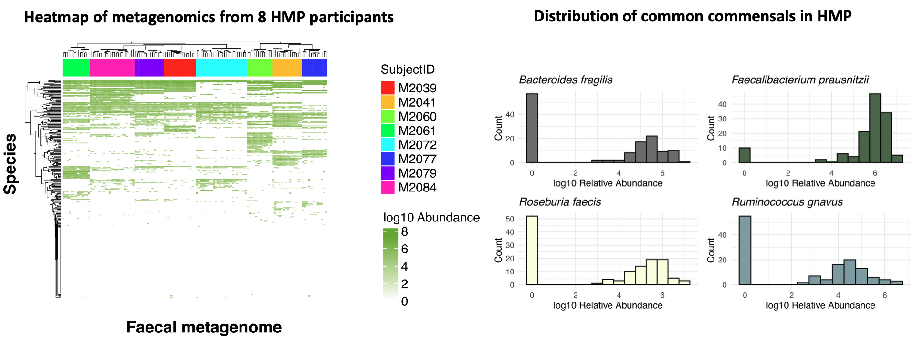

## The challenge with interpreting differences in microbiome data

In human microbiome studies, a common goal is to compare microbial profiles between groups. For example, treated vs untreated, disease vs control, or timepoint 1 vs timepoint 2.
We usually do this with differential abundance (DA) analysis, which tests whether individual bacteria differ between groups.

There are many DA methods, but they all share the same basic premise: test microbes one by one.

Although this is standard practice, it raises a problem that is rarely discussed. People rarely share the same exact microbial species. Even in large cohorts, most taxa are low-prevalence. For example, in the Human Microbiome Project, applying a modest 20% prevalence filter (a species must appear in ≥20% of samples) removes the vast majority of species from analysis.

*Figure 1. On the left, a heatmap of species-level profiles from eight randomly selected participants in the Human Microbiome Project shows that samples cluster almost perfectly by individual, highlighting strong inter-individual variation. On the right, a histogram of common commensal species prevalence demonstrates that many taxa are absent from most samples, illustrating why species-level differential abundance is often sparse and hard to reproduce.*

At the same time, there is still no consensus on the “best” DA method. In fact, method choice can dominate the biology: across 53 real gut microbiome studies, several widely used DA tools produced inconsistent results. That same benchmark suggests that much of what we call DA signal is often prevalence-driven (zeros vs non-zeros) rather than subtle abundance shifts [Pelto et al., 2025](https://academic.oup.com/bib/article/26/2/bbaf130/8093585)

Much of the field has therefore focused on finding the optimal DA method. But there is a more fundamental question we rarely ask: is differential abundance the right question to begin with?

Of course, it is possible that a single microbe drives a phenotype. But if one bacterium were responsible for complex diseases such as inflammatory bowel disease, it would likely have been identified long ago. Instead, what we observe in the overwhelming majority of human microbiome studies is not the dominance of a single species, but coordinated shifts across whole communities, patterns often described in terms of diversity or dysbiosis. 

The problem is that these concepts are usually not very actionable. They are relative descriptions: there is no single “dysbiotic” or “healthy” microbiome, and even diversity itself is a contextual measure rather than a biological mechanism [O’Toole et al., 2023](https://www.gastrojournal.org/article/S0016-5085(23)00622-4/fulltext) Recent large-scale meta-analyses reinforce this view, showing that many so-called dysbiotic signatures reflect a shared, non-specific response to disease with limited diagnostic or mechanistic value [Duvallet et al., 2017](https://www.nature.com/articles/s41467-017-01973-8)
(Duvallet et al., 2017; O’Toole et al., 2023).

In other ’omics fields, single-feature testing makes far more sense. When comparing gene expression, epigenomes, or proteomes, samples broadly share the same set of features, they differ in levels, not in whether the features exist at all. In microbiome data, this assumption breaks down completely: there are no universally shared species.

In short: traditional differential abundance asks us to compare microbes one by one, but human microbiomes don’t work that way. Most species are rare, poorly shared between people, and results depend heavily on which method you choose. What we usually observe in real studies is not single “causal” microbes, but broad, coordinated shifts across communities: patterns that DA struggles to capture in a consistent or biologically meaningful way.

## The idea behind Taxon Set Enrichment Analysis
Taxon Set Enrichment Analysis starts from a simple observation: in most human microbiome studies, biology is rarely driven by a single species. What changes instead are groups of microbes that share a common trait.
Rather than asking “which individual bugs changed?”, TSEA asks a more useful question:
“are microbes with a shared biological property shifting together?”

For example, are we seeing shifts in:

- facultative anaerobes?
- taxa previously associated with inflammatory bowel disease?
- butyrate producers?
- mucin-utilisers?

TaxSEA implements this idea as an R package by using curated biological databases to define thousands of such groups, then applying a rank-based enrichment test.

Under the hood, TaxSEA also handles a lot of practical complexity for you such as harmonising taxon names across databases, converting identifiers, and providing consistently formatted resources so different knowledge bases can be used together.

## But isn’t this what functional profiling tools (e.g. HUMAnN3) do?

Not really. Functional profiling tools work directly on gene families and pathways.
TaxSEA works on traits linked to taxa (species/strains) based on prior knowledge
and curated resources. 

These approaches are related, but they are not the same. For example, we may know a species can utilise mucin from in vitro work, even when the precise genes or pathways responsible are unclear (or inconsistently annotated). In that case, a trait-based grouping can capture biology that pathway-based methods might miss.

Similarly, TaxSEA can tell you whether your data recapitulates a microbial signature previously reported in another disease or context — something functional tools are not designed to do.

TaxSEA is also lightweight: it only needs a species label plus a rank (e.g. log2 fold change or correlation) and runs in seconds on a laptop.

It is not meant to replace functional profiling, but to complement it — providing biological context and prioritisation before you invest time and resources in deeper functional analyses.

